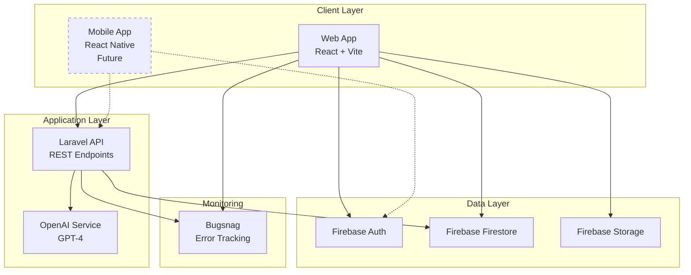
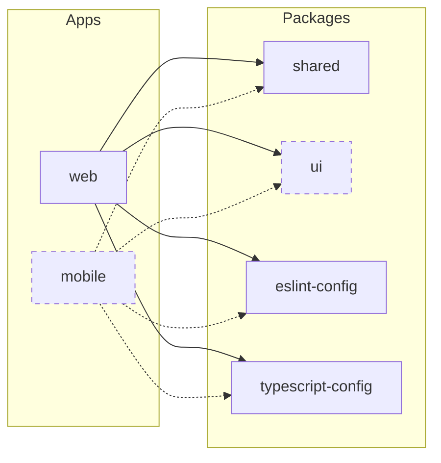
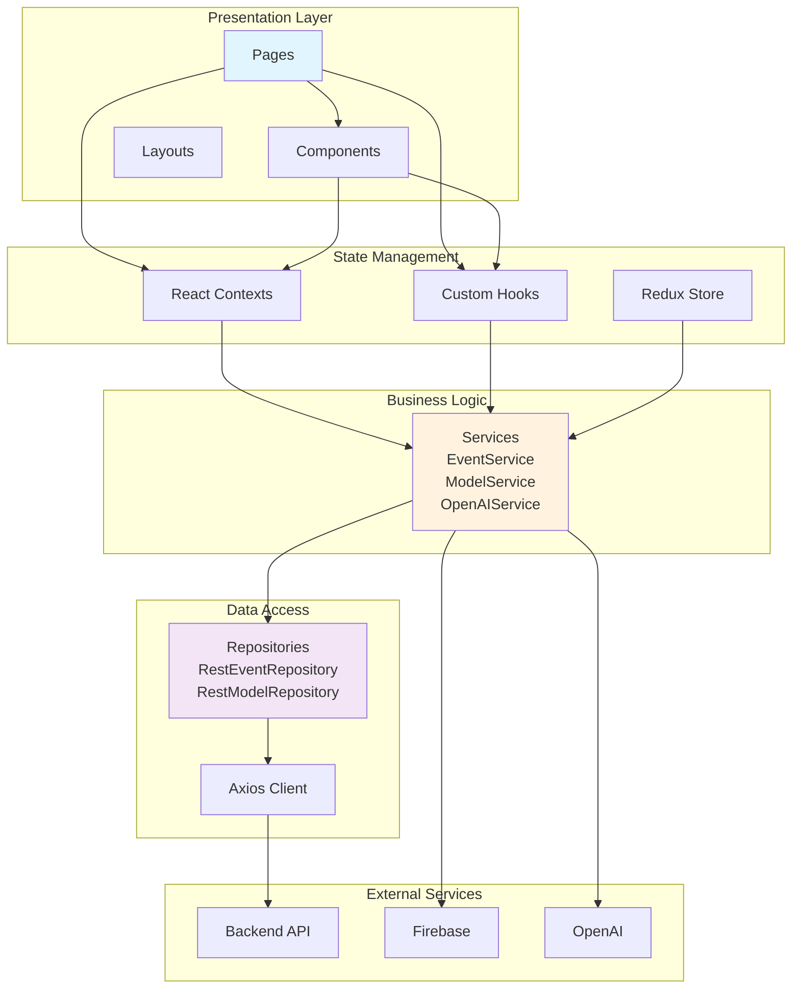
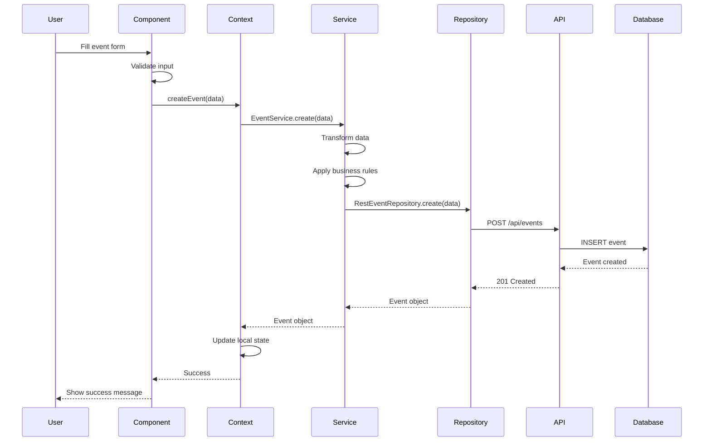
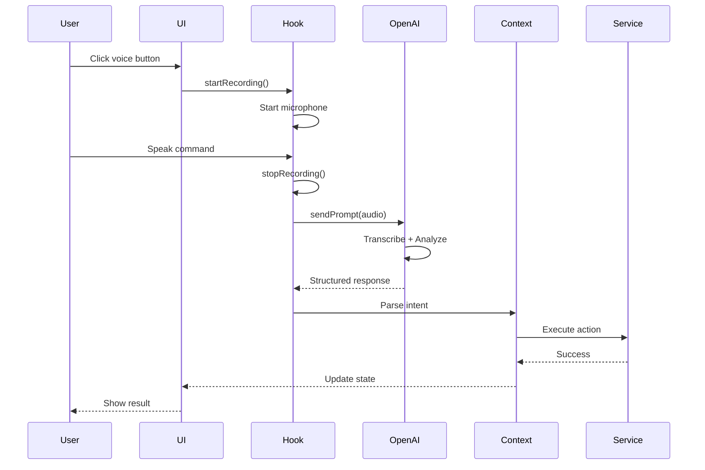
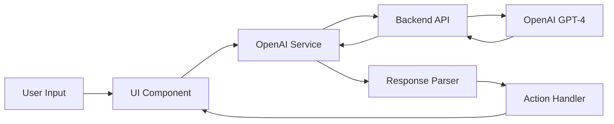
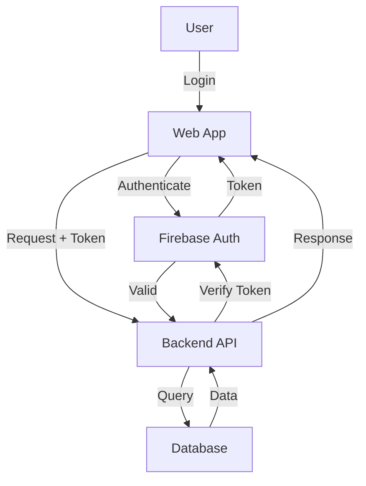
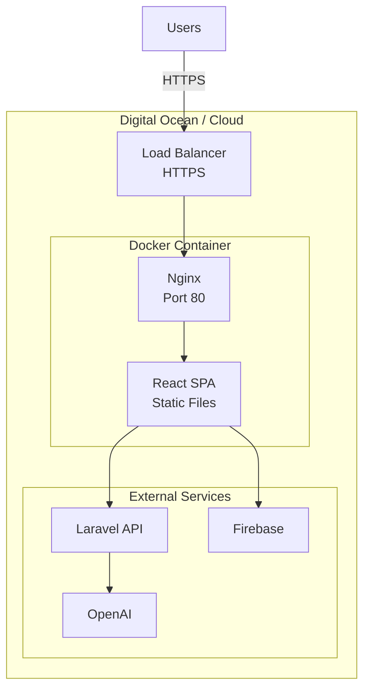

# GastonApp Architecture

This document provides a comprehensive overview of the GastonApp architecture, including system design, data flow, component structure, and technical decisions.

## Table of Contents

- [System Overview](#system-overview)
- [Monorepo Structure](#monorepo-structure)
- [Technology Stack](#technology-stack)
- [Architecture Diagrams](#architecture-diagrams)
- [Application Layers](#application-layers)
- [Data Flow](#data-flow)
- [State Management](#state-management)
- [Component Architecture](#component-architecture)
- [Backend Integration](#backend-integration)
- [AI Integration](#ai-integration)
- [Security Architecture](#security-architecture)
- [Deployment Architecture](#deployment-architecture)
- [Design Decisions](#design-decisions)
- [Future Considerations](#future-considerations)

---

## System Overview

GastonApp is a **multi-platform pet management system** built as a **Turborepo monorepo** that enables pet owners to:

- Manage multiple pet profiles
- Schedule and track pet care events
- Use AI-powered voice assistance
- Access the platform via web and mobile (future)

### Key Characteristics

- **Platform**: Multi-platform (Web + Mobile future)
- **Architecture**: Monorepo with shared code
- **Frontend**: React-based SPAs
- **Backend**: Laravel API + Firebase
- **AI**: OpenAI GPT-4 integration
- **Deployment**: Docker + Nginx

---

## Monorepo Structure

```
GastonApp/
│
├── apps/                           # Applications
│   ├── web/                        # React web application
│   │   ├── src/
│   │   │   ├── components/        # UI components
│   │   │   ├── contexts/          # React contexts
│   │   │   ├── hooks/             # Custom hooks
│   │   │   ├── pages/             # Page components
│   │   │   ├── services/          # Business logic
│   │   │   ├── repository/        # Data access layer
│   │   │   ├── store/             # Redux store
│   │   │   ├── types/             # TypeScript types
│   │   │   └── router/            # Routing configuration
│   │   └── package.json
│   │
│   └── mobile/                     # React Native (future)
│       └── package.json
│
├── packages/                       # Shared packages
│   ├── shared/                     # Shared business logic
│   │   ├── src/
│   │   │   ├── types/             # Shared TypeScript types
│   │   │   ├── utils/             # Utility functions
│   │   │   └── index.ts
│   │   └── package.json
│   │
│   ├── ui/                         # Shared UI components (future)
│   ├── eslint-config/              # Shared ESLint configs
│   └── typescript-config/          # Shared TS configs
│
├── .deploy/                        # Deployment configs
│   ├── Dockerfile
│   ├── docker-compose.yml
│   └── nginx.conf
│
├── turbo.json                      # Turborepo configuration
└── pnpm-workspace.yaml             # pnpm workspaces
```

---

## Technology Stack

### Frontend (Web App)

| Layer | Technology | Purpose |
|-------|------------|---------|
| **Framework** | React 18 | UI framework |
| **Language** | TypeScript | Type safety |
| **Build Tool** | Vite | Fast builds and HMR |
| **UI Library** | Mantine v5 | Component library |
| **Styling** | Tailwind CSS | Utility-first CSS |
| **State** | Redux Toolkit | Global state management |
| **Routing** | React Router | Client-side routing |
| **Forms** | React Hook Form | Form management |
| **i18n** | i18next | Internationalization |
| **Icons** | FontAwesome | Icon library |

### Backend

| Service | Technology | Purpose |
|---------|------------|---------|
| **API** | Laravel (PHP) | RESTful API server |
| **Database** | Firebase Firestore | NoSQL database |
| **Authentication** | Firebase Auth | User authentication |
| **Storage** | Firebase Storage | File storage |
| **AI** | OpenAI GPT-4 | AI assistant |

### Infrastructure

| Layer | Technology | Purpose |
|-------|------------|---------|
| **Monorepo** | Turborepo | Build orchestration |
| **Package Manager** | pnpm | Fast, efficient package management |
| **Containerization** | Docker | Application containerization |
| **Web Server** | Nginx | Reverse proxy and static serving |
| **Monitoring** | Bugsnag | Error tracking and performance |

---

## Architecture Diagrams

### High-Level System Architecture



### Monorepo Package Dependencies



### Web Application Architecture



---

## Application Layers

### 1. Presentation Layer

**Responsibilities**: UI rendering, user interactions, visual feedback

**Components**:
- **Pages**: Top-level route components (`apps/web/src/pages/`)
- **Components**: Reusable UI components (`apps/web/src/components/`)
- **Layouts**: Page layout structures (`apps/web/src/components/Layouts/`)

**Key Patterns**:
- Functional components with hooks
- Composition over inheritance
- Props drilling minimized via contexts
- TypeScript for type safety

### 2. State Management Layer

**Responsibilities**: Application state, data synchronization, side effects

**Technologies**:
- **React Context API**: Component-scoped state (Pets, Events, Global)
- **Redux Toolkit**: Global app state (theme, user preferences)
- **Custom Hooks**: Reusable stateful logic

**Key Contexts**:
- `PetsContext`: Pet data and CRUD operations
- `EventsContext`: Event scheduling and management
- `AIAssistantContext`: AI assistant state
- `GlobalContext`: App-wide state
- `MessageContext`: Message/notification system

### 3. Business Logic Layer

**Responsibilities**: Business rules, data transformation, orchestration

**Services** (`apps/web/src/services/`):
- `EventService`: Event creation, recurrence, management
- `ModelService`: Pet (model) CRUD operations
- `OpenAIService`: AI integration and prompts
- `ConversationService`: AI conversation management

**Patterns**:
- Singleton pattern for services
- Dependency injection via constructor
- Error handling and validation

### 4. Data Access Layer

**Responsibilities**: API communication, data persistence, caching

**Repositories** (`apps/web/src/repository/`):
- `RestEventRepository`: Event API calls
- `RestModelRepository`: Pet API calls

**HTTP Client**:
- Axios with interceptors
- Error handling middleware
- Request/response transformation

### 5. External Services Layer

**Firebase Services**:
- **Authentication**: User login/signup
- **Firestore**: NoSQL database for real-time data
- **Storage**: File and image uploads

**Backend API** (Laravel):
- RESTful endpoints for business logic
- Data validation
- Business rule enforcement

**AI Services** (OpenAI):
- Natural language processing
- Event suggestions
- Voice transcription

---

## Data Flow

### Event Creation Flow



### Voice Command Flow



---

## State Management

### Global State (Redux)

```typescript
// Redux Store Structure
{
  themeConfig: {
    theme: 'light' | 'dark',
    locale: 'en' | 'fr' | ...,
    menu: 'vertical' | 'horizontal',
    layout: 'full' | 'boxed',
    rtlClass: 'ltr' | 'rtl',
    animation: string,
    navbar: 'navbar-sticky' | 'navbar-floating',
    semidark: boolean,
    sidebar: boolean
  }
}
```

### Context State

```typescript
// PetsContext
{
  pets: Pet[],
  loading: boolean,
  error: string | null,
  refreshPets: () => Promise<void>,
  addPet: (pet: Pet) => Promise<void>,
  updatePet: (id: string, pet: Partial<Pet>) => Promise<void>,
  deletePet: (id: string) => Promise<void>
}

// EventsContext
{
  events: Event[],
  loading: boolean,
  error: string | null,
  refreshEvents: () => Promise<void>,
  createEvent: (event: EventData) => Promise<void>,
  updateEvent: (id: string, event: Partial<EventData>) => Promise<void>,
  deleteEvent: (id: string) => Promise<void>,
  toggleEventCompletion: (id: string) => Promise<void>
}
```

---

## Component Architecture

### Component Hierarchy

```
App
├── Router
│   ├── MainLayout
│   │   ├── Header
│   │   ├── Sidebar
│   │   │   └── Navigation
│   │   └── Content
│   │       ├── Dashboard
│   │       ├── Pets
│   │       │   ├── PetsTable
│   │       │   ├── PetForm
│   │       │   └── PetCard
│   │       ├── Events
│   │       │   ├── EventCalendar
│   │       │   ├── EventTable
│   │       │   ├── EventForm
│   │       │   └── EventCard
│   │       └── Settings
│   └── Modals
│       ├── ActionModal (AI Assistant)
│       └── ConfirmModal
└── Providers
    ├── GlobalProvider
    ├── PetsProvider
    ├── EventsProvider
    └── AIAssistantProvider
```

### Component Patterns

#### Smart vs Presentational Components

```typescript
// Smart Component (Container)
const PetsPage = () => {
  const { pets, loading, refreshPets } = usePets();

  useEffect(() => {
    refreshPets();
  }, []);

  return <PetsTable pets={pets} loading={loading} />;
};

// Presentational Component
interface PetsTableProps {
  pets: Pet[];
  loading: boolean;
}

const PetsTable = ({ pets, loading }: PetsTableProps) => {
  if (loading) return <Skeleton />;

  return (
    <Table>
      {pets.map(pet => <PetRow key={pet.id} pet={pet} />)}
    </Table>
  );
};
```

---

## Backend Integration

### API Communication

#### REST API Endpoints

```
# Events
GET    /api/events              # List all events
POST   /api/events              # Create event
GET    /api/events/{id}         # Get single event
PUT    /api/events/{id}         # Update event
DELETE /api/events/{id}         # Delete event
PATCH  /api/events/{id}/toggle  # Toggle completion

# Pets (Models)
GET    /api/models              # List all pets
POST   /api/models              # Create pet
GET    /api/models/{id}         # Get single pet
PUT    /api/models/{id}         # Update pet
DELETE /api/models/{id}         # Delete pet

# AI
POST   /ai                      # Send AI prompt
POST   /ai/stream               # Streaming AI response
```

#### Request/Response Format

```typescript
// Request
POST /api/events
{
  "type": "feeding",
  "pet_id": 123,
  "scheduled_at": "2025-11-11T08:00:00Z",
  "recurrence": {
    "frequency": "daily",
    "interval": 1
  },
  "owner_id": 1
}

// Response
{
  "id": 456,
  "type": "feeding",
  "pet_id": 123,
  "scheduled_at": "2025-11-11T08:00:00Z",
  "is_done": false,
  "created_at": "2025-11-11T07:00:00Z",
  "updated_at": "2025-11-11T07:00:00Z"
}
```

### Firebase Integration

```typescript
// Firebase Configuration
{
  apiKey: process.env.VITE_FIREBASE_API_KEY,
  authDomain: process.env.VITE_FIREBASE_AUTH_DOMAIN,
  projectId: process.env.VITE_FIREBASE_PROJECT_ID,
  storageBucket: process.env.VITE_FIREBASE_STORAGE_BUCKET,
  messagingSenderId: process.env.VITE_FIREBASE_MESSAGING_SENDER_ID,
  appId: process.env.VITE_FIREBASE_APP_ID
}
```

**Usage**:
- **Auth**: User authentication and session management
- **Firestore**: Real-time data synchronization
- **Storage**: Image and file uploads for pet photos

---

## AI Integration

### OpenAI Service Architecture



### AI Features

1. **Voice Commands**
   - Speech-to-text transcription
   - Intent detection
   - Entity extraction (pet name, time, event type)

2. **Event Suggestions**
   - Analyze user patterns
   - Suggest recurring events
   - Recommend optimal schedules

3. **Conversational Interface**
   - Multi-turn dialogues
   - Context awareness
   - Natural language understanding

### AI Request Flow

```typescript
// 1. User speaks command
const audioData = await recordAudio();

// 2. Send to OpenAI service
const response = await openAIService.sendPromptApi(audioData);

// 3. Parse response
const intent = parseIntent(response);

// 4. Execute action
if (intent.type === 'create_event') {
  await eventService.createEvent(intent.data);
}
```

---

## Security Architecture

### Authentication & Authorization



### Security Measures

1. **Frontend Security**
   - Environment variables for API keys
   - No secrets in client code
   - HTTPS only in production
   - XSS protection via React
   - CSRF tokens for mutations

2. **API Security**
   - JWT token authentication
   - Request validation
   - Rate limiting
   - CORS configuration
   - Input sanitization

3. **Data Security**
   - Firebase security rules
   - Encrypted connections (TLS)
   - Secure token storage
   - No sensitive data in localStorage

4. **Monitoring**
   - Bugsnag error tracking
   - Performance monitoring
   - Security audit logging

---

## Deployment Architecture

### Production Deployment



### Docker Architecture

```dockerfile
# Multi-stage build
FROM node:22-alpine AS builder
# Build application

FROM nginx:alpine AS production
# Serve static files
```

**Benefits**:
- Minimal production image size
- Fast deployments
- Consistent environments
- Easy scaling

### Environment Configuration

```yaml
# docker-compose.yml
services:
  web:
    build: .
    ports:
      - "80:80"
    environment:
      - VITE_API_URL=${VITE_API_URL}
      - VITE_FIREBASE_API_KEY=${VITE_FIREBASE_API_KEY}
    volumes:
      - ./nginx.conf:/etc/nginx/nginx.conf
```

---

## Design Decisions

### Why Turborepo Monorepo?

**Benefits**:
- **Code Sharing**: Share types, services, and utilities between web and mobile
- **Atomic Changes**: Update shared code and all apps in one commit
- **Consistent Tooling**: Same ESLint, TypeScript, and Prettier configs
- **Faster Builds**: Turborepo caches and parallelizes builds
- **Simplified Development**: Single repository to clone and manage

**Trade-offs**:
- Larger repository size
- More complex CI/CD setup
- Learning curve for team members

### Why pnpm?

**Benefits**:
- **Disk Efficiency**: Content-addressable storage saves space
- **Speed**: Faster installs than npm/yarn
- **Strict**: Prevents phantom dependencies
- **Workspace Support**: Native monorepo support

### Why React + TypeScript?

**Benefits**:
- **Type Safety**: Catch errors at compile time
- **Developer Experience**: Excellent tooling and autocomplete
- **Maintainability**: Self-documenting code
- **Ecosystem**: Rich component libraries and tools

### Why Firebase?

**Benefits**:
- **Real-time**: Live data synchronization
- **Authentication**: Built-in auth providers
- **Scalability**: Managed infrastructure
- **Free Tier**: Good for MVP and development

**Trade-offs**:
- Vendor lock-in
- Limited complex queries
- Cost at scale

### Why Vite over Create React App?

**Benefits**:
- **Speed**: Fast HMR and builds
- **Modern**: Native ES modules
- **Flexible**: Easy configuration
- **Optimized**: Better production builds

---

## Future Considerations

### Planned Improvements

1. **Mobile App**
   - React Native + Expo implementation
   - Share business logic via `@gastonapp/shared`
   - Native features (push notifications, camera)

2. **Shared UI Package**
   - Extract common components to `@gastonapp/ui`
   - Platform-agnostic component library
   - Storybook for component documentation

3. **Testing**
   - Unit tests with Vitest
   - Integration tests with React Testing Library
   - E2E tests with Playwright
   - Minimum 70% code coverage

4. **CI/CD Pipeline**
   - GitHub Actions workflows
   - Automated testing on PR
   - Automated deployments
   - Preview environments

5. **Performance Optimization**
   - Code splitting by route
   - Image optimization
   - Service Worker for offline support
   - PWA capabilities

6. **Enhanced AI**
   - Pattern detection and insights
   - Proactive suggestions
   - Multi-modal input (voice + text + image)
   - Context-aware conversations

### Scalability Considerations

1. **Data Layer**
   - Consider migrating to PostgreSQL for complex queries
   - Implement caching layer (Redis)
   - Database indexing optimization

2. **API Layer**
   - API rate limiting
   - Response caching
   - GraphQL consideration for complex queries

3. **Frontend**
   - Implement virtual scrolling for large lists
   - Lazy loading for images and components
   - Service Worker for offline functionality

4. **Infrastructure**
   - CDN for static assets
   - Kubernetes for container orchestration
   - Auto-scaling based on load

---

## Additional Resources

- **[README.md](README.md)** - Project overview and quick start
- **[CLAUDE.md](CLAUDE.md)** - Developer guide and workflows
- **[DEPLOYMENT.md](DEPLOYMENT.md)** - Deployment instructions
- **[CONTRIBUTING.md](CONTRIBUTING.md)** - Contribution guidelines

---

**Questions or suggestions?** Open an issue on [GitHub](https://github.com/fredattack/GastonApp/issues).

Last Updated: November 11, 2025
